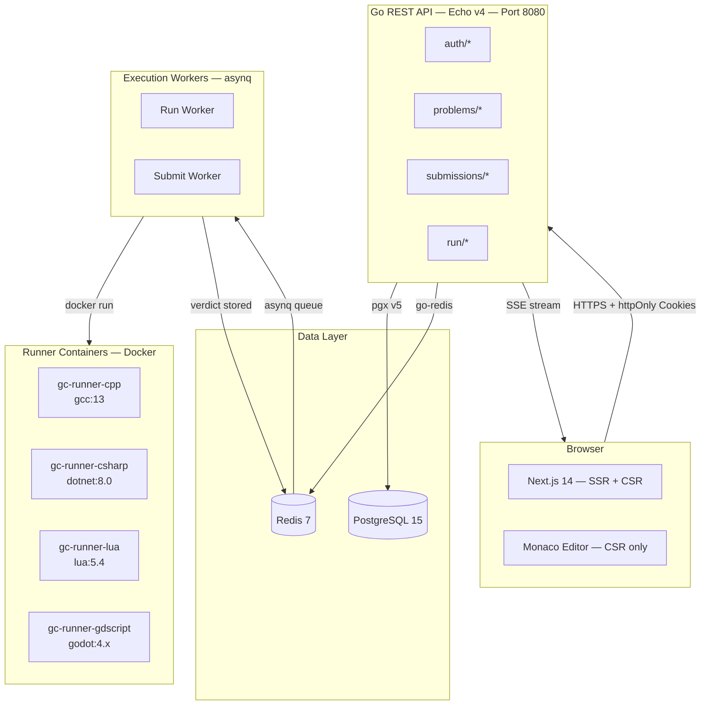

<div align="center">

<h1>GameCode</h1>

<p><strong>The LeetCode for Game Developers.</strong><br/>
Practice real engine math, AI, physics, pathfinding, and systems design — in C#, C++, Lua, and GDScript.</p>

<p>
  
  
  
  
  
  
  <a href="https://discord.gg/gamecode">
    
  </a>
</p>

<p>
  <a href="https://gamecode.dev">Live Demo</a>
  &nbsp;·&nbsp;
  <a href="https://docs.gamecode.dev">Documentation</a>
  &nbsp;·&nbsp;
  <a href="https://github.com/gc-platform/gamecode/issues/new?template=bug_report.md">Report a Bug</a>
  &nbsp;·&nbsp;
  <a href="https://github.com/gc-platform/gamecode/issues/new?template=feature_request.md">Request a Feature</a>
  &nbsp;·&nbsp;
  <a href="https://discord.gg/gamecode">Discord</a>
</p>

</div>

---

## What is GameCode?

GameCode is an **open-source** coding practice platform purpose-built for game developers. Think LeetCode — same problem-solving flow, same run/submit loop, same density — but every problem maps to a real system inside a game engine.

You are not memorizing API calls. You are learning why engines are built the way they are.

```
Browse Problems  →  Understand the engine concept  →  Code in C#, C++, or Lua  →  Run & Submit  →  Read the editorial
```

No streaks. No coins. No leaderboards. Just you and the compiler.

> GameCode is in active development. We are currently in **v0.3.0** (private beta). [Join the waitlist](https://gamecode.dev)

---

## Table of Contents

- [Philosophy](#philosophy)
- [Features](#features)
- [Tech Stack](#tech-stack)
- [Architecture](#architecture)
- [Getting Started](#getting-started)
  - [Docker (Recommended)](#docker-recommended)
  - [Manual Setup](#manual-setup)
- [Environment Variables](#environment-variables)
- [Project Structure](#project-structure)
- [Problem Taxonomy](#problem-taxonomy)
- [Code Execution Engine](#code-execution-engine)
- [API Reference](#api-reference)
- [Roadmap](#roadmap)
- [Contributing](#contributing)
- [License](#license)

---

## Philosophy

| Principle | What it means |
|-----------|---------------|
| Engine-agnostic concepts | We teach the math, algorithms, and patterns behind game engines — not engine-specific API calls. A vector lerp is a vector lerp whether you are in Unity or Unreal. |
| Zero gamification | No streaks, coins, badges, XP, or social feeds. We respect your time. |
| Frictionless practice | You should be writing code within 60 seconds of landing on the site. |
| Editorial depth | Every problem ships with an editorial explaining *why* the system exists in real engines, not just the algorithm. |
| Open source | Every line of code, every problem, and every editorial is open. Built in public, for the community. |

---

## Features

- **Multi-Language Support** — Write and execute in C# (.NET 8), C++ (g++ 13, -std=c++17), Lua (5.4), and GDScript (4.x).
- **Sandboxed Execution** — Each run gets an isolated Docker container. Network disabled, read-only filesystem, strict RAM and CPU caps. No escape.
- **Intelligent Problem Browsing** — Full-text search, tag filtering, difficulty filter, status filter, and language filter — all composable and URL-persisted.
- **Monaco Editor** — VS Code's editor, directly in the browser. Language-aware syntax highlighting and IntelliSense.
- **Submission History** — Full history with verdicts (AC, WA, TLE, MLE, RTE, CE), runtime, and memory per submission.
- **Curated Learning Paths** — "Beginner Game Dev", "Pathfinding Deep Dive", "Physics Systems" — structured problem sets for deliberate practice.
- **Secure Authentication** — GitHub OAuth, Google OAuth, and magic-link email. JWT-based with silent auto-refresh.
- **Admin CMS** — Markdown problem editor, test case manager, per-language starter code editor, and editorial editor. Full content workflow: Draft → Review → Published.
- **Accessible** — Keyboard navigable, WCAG AA color contrast, reduced motion respected.

---

## Tech Stack

### Frontend

| Technology | Purpose |
|------------|---------|
| [Next.js 14](https://nextjs.org) (App Router) | SSR for SEO on problem pages. CSR for the editor. |
| [TypeScript](https://typescriptlang.org) strict | End-to-end type safety. No `any`. |
| [Tailwind CSS v3](https://tailwindcss.com) | Utility-first styling. |
| [Monaco Editor](https://microsoft.github.io/monaco-editor/) | VS Code's editor engine. Loaded from CDN — not bundled. |
| [TanStack Query v5](https://tanstack.com/query) | Server state, submission polling, optimistic mutations. |
| [react-resizable-panels](https://github.com/bvaughn/react-resizable-panels) | Three-panel solve layout with drag-to-resize. |
| [ky](https://github.com/sindresorhus/ky) | Lightweight fetch wrapper with automatic JWT refresh. |

### Backend

| Technology | Purpose |
|------------|---------|
| [Go 1.22+](https://go.dev) | Compiled, fast, single binary. Goroutines make concurrency natural. |
| [Echo v4](https://echo.labstack.com) | High-performance HTTP framework. ~200k req/s per core. |
| [PostgreSQL 15](https://postgresql.org) | Primary database. Full-text search via `pg_trgm`. |
| [sqlc](https://sqlc.dev) | Type-safe SQL. Write SQL, get Go structs. Zero reflection, zero runtime panics from bad queries. |
| [golang-migrate](https://github.com/golang-migrate/migrate) | Raw SQL migration files. Deterministic, reviewable. |
| [asynq](https://github.com/hibiken/asynq) | Redis-backed job queue for code execution workers. |
| [Redis 7](https://redis.io) | Session cache, rate limiting, SSE pub/sub, job queue. |
| [golang-jwt/jwt v5](https://github.com/golang-jwt/jwt) | JWT access + refresh token pair. |

### Infrastructure

| Technology | Purpose |
|------------|---------|
| [Docker](https://docker.com) | Containerized runner sandboxes per code execution. |
| [Vercel](https://vercel.com) | Next.js frontend with edge caching. |
| [Railway](https://railway.app) | Go API binary deployment. |
| [Neon](https://neon.tech) | Serverless PostgreSQL with branch-per-PR previews. |
| [Upstash](https://upstash.com) | Serverless Redis. |
| [GitHub Actions](https://github.com/features/actions) | CI/CD for both apps. |

---

## Architecture



### Execution Flow

**Run Code — fast path, ~2s:**
```
POST /api/run
  → validate + rate-limit
  → enqueue asynq job (priority: high)
  → return { run_id }

Client opens SSE: GET /api/run/:runId/stream
  → worker picks job
  → spawns Docker container
  → captures stdout
  → stores result in Redis
  → SSE handler streams result to browser
```

**Submit Code — full evaluation:**
```
POST /api/submissions
  → create row (verdict = pending)
  → enqueue asynq job (priority: normal)
  → return { submission_id }

Client polls: GET /api/submissions/:id every 1.5s
  → worker fetches ALL test cases
  → runs each in Docker container sequentially
  → aggregates verdict
  → UPDATE submissions SET verdict = ...
  → client poll resolves with final verdict
```

### Docker Sandbox — every execution

```bash
docker run                          \
  --rm                              \
  --network none                    \  # No outbound network access
  --memory 256m                     \  # Hard memory cap
  --memory-swap 256m                \  # No swap allowed
  --cpus 1.0                        \  # 1 CPU max
  --pids-limit 64                   \  # No fork bombs
  --ulimit nofile=64:64             \  # No file descriptor exhaustion
  --read-only                       \  # Immutable container filesystem
  --tmpfs /tmp:size=32m,noexec      \  # Writable /tmp, non-executable
  --stop-timeout 5                  \  # Hard kill after 5s
  -v /tmp/gc-jobs/$JOB_ID:/workspace:ro \
  gc-runner-$LANGUAGE:latest
```

---

## Getting Started

### Prerequisites

- [Docker](https://docs.docker.com/get-docker/) and [Docker Compose](https://docs.docker.com/compose/install/)
- [Go 1.22+](https://go.dev/dl/)
- [Node.js 20+](https://nodejs.org/) and `npm`
- [golang-migrate CLI](https://github.com/golang-migrate/migrate#installation)
- [sqlc CLI](https://docs.sqlc.dev/en/stable/overview/install.html)

---

### Docker (Recommended)

The fastest way to get the full stack running locally.

**1. Clone the repository**

```bash
git clone https://github.com/gc-platform/gamecode.git
cd gamecode
```

**2. Configure environment**

```bash
cp apps/api/.env.example  apps/api/.env
cp apps/web/.env.example  apps/web/.env.local
```

Edit both files. The minimum required values are `DATABASE_URL`, `REDIS_ADDR`, `JWT_ACCESS_SECRET`, `JWT_REFRESH_SECRET`, `GITHUB_CLIENT_ID`, `GITHUB_CLIENT_SECRET`, and `FRONTEND_URL`.

**3. Start all services**

```bash
docker compose -f docker/docker-compose.dev.yml up
```

This starts PostgreSQL, Redis, the Go API (with hot-reload via [air](https://github.com/air-verse/air)), and the Next.js dev server.

| Service | URL |
|---------|-----|
| Frontend | http://localhost:3000 |
| Go API | http://localhost:8080 |
| PostgreSQL | localhost:5432 |
| Redis | localhost:6379 |

**4. Run migrations and seed**

```bash
make migrate-up   # Apply all database migrations
make seed         # Seed 10 sample problems, tags, and curated lists
```

Open [http://localhost:3000](http://localhost:3000).

---

### Manual Setup

**1. Start PostgreSQL and Redis**

```bash
docker run -d --name gc-pg \
  -e POSTGRES_DB=gamecode_dev \
  -e POSTGRES_USER=gc \
  -e POSTGRES_PASSWORD=gc \
  -p 5432:5432 postgres:15-alpine

docker run -d --name gc-redis \
  -p 6379:6379 redis:7-alpine
```

**2. Backend**

```bash
cd apps/api

cp .env.example .env
# Edit .env with your values

# Run database migrations
migrate -path internal/db/migrations \
        -database "postgres://gc:gc@localhost:5432/gamecode_dev?sslmode=disable" up

# Generate sqlc types (only needed when .sql query files change)
sqlc generate

# Start the API server on port 8080
go run ./cmd/api/main.go
```

**3. Build runner images**

Code execution requires pre-built Docker images for each supported language.

```bash
make build-runners

# Or individually:
docker build -t gc-runner-cpp:latest    docker/runners/cpp/
docker build -t gc-runner-csharp:latest docker/runners/csharp/
docker build -t gc-runner-lua:latest    docker/runners/lua/
```

**4. Frontend**

```bash
cd apps/web

npm install

cp .env.example .env.local
# Edit .env.local — set NEXT_PUBLIC_API_URL=http://localhost:8080

npm run dev
```

---

## Environment Variables

### Backend — `apps/api/.env`

| Variable | Required | Default | Description |
|----------|:--------:|---------|-------------|
| `PORT` | No | `8080` | API server port |
| `ENVIRONMENT` | No | `development` | `development` or `production` |
| `DATABASE_URL` | Yes | — | PostgreSQL connection string |
| `REDIS_ADDR` | Yes | — | Redis `host:port` |
| `REDIS_PASSWORD` | No | — | Redis password (if auth is enabled) |
| `JWT_ACCESS_SECRET` | Yes | — | Random 64-char string. Signs access tokens (15 min TTL). |
| `JWT_REFRESH_SECRET` | Yes | — | Different 64-char string. Signs refresh tokens (7 day TTL). |
| `ACCESS_TOKEN_TTL` | No | `15` | Access token TTL in minutes |
| `REFRESH_TOKEN_TTL` | No | `7` | Refresh token TTL in days |
| `GITHUB_CLIENT_ID` | Yes | — | GitHub OAuth App Client ID |
| `GITHUB_CLIENT_SECRET` | Yes | — | GitHub OAuth App Client Secret |
| `GOOGLE_CLIENT_ID` | Yes | — | Google OAuth Client ID |
| `GOOGLE_CLIENT_SECRET` | Yes | — | Google OAuth Client Secret |
| `FRONTEND_URL` | Yes | — | Frontend origin. Used for CORS and OAuth redirects. |
| `MAX_WORKERS` | No | `4` | asynq worker concurrency (parallel executions) |
| `DOCKER_RUNNER_TAG` | No | `latest` | Docker image tag for runner containers |
| `RESEND_API_KEY` | Yes | — | [Resend](https://resend.com) API key for magic link emails |
| `EMAIL_FROM` | No | `noreply@gamecode.dev` | Sender address for transactional emails |

Generate secrets:

```bash
openssl rand -hex 32   # Run twice — once per JWT secret
```

### Frontend — `apps/web/.env.local`

| Variable | Required | Description |
|----------|:--------:|-------------|
| `NEXT_PUBLIC_API_URL` | Yes | Go API public URL (e.g. `http://localhost:8080`) |
| `API_URL` | Yes | Go API URL for server-side fetches. Same as above in dev; internal URL in prod. |
| `NEXT_PUBLIC_ENV` | No | `development` or `production` |

---

## Project Structure

```
gamecode/
│
├── apps/
│   ├── api/                          # Go REST API
│   │   ├── cmd/
│   │   │   └── api/main.go           # Entrypoint — wires all dependencies, starts server + workers
│   │   ├── internal/
│   │   │   ├── config/               # Viper config struct
│   │   │   ├── db/
│   │   │   │   ├── migrations/       # Raw SQL migrations (golang-migrate)
│   │   │   │   ├── queries/          # sqlc source query files (.sql)
│   │   │   │   └── sqlc/             # Auto-generated Go code — do not edit
│   │   │   ├── domain/               # Pure Go types + domain errors (no external dependencies)
│   │   │   ├── repository/           # Database access (implements domain interfaces)
│   │   │   ├── service/              # Business logic
│   │   │   ├── handler/              # Echo HTTP handlers (thin — bind, call service, respond)
│   │   │   ├── middleware/           # Auth, rate-limit, request logging, role enforcement
│   │   │   ├── executor/             # Code execution: Docker sandbox, asynq workers, language runners
│   │   │   └── cache/                # Typed Redis cache helper
│   │   ├── pkg/
│   │   │   ├── apierr/               # Typed HTTP error responses
│   │   │   ├── jwt/                  # Token issue and validate
│   │   │   ├── oauth/                # GitHub + Google OAuth2 flows
│   │   │   └── pagination/           # Offset pagination helpers
│   │   ├── go.mod
│   │   └── sqlc.yaml
│   │
│   └── web/                          # Next.js 14 frontend
│       ├── app/
│       │   ├── (auth)/login/         # Login page
│       │   ├── (main)/
│       │   │   ├── page.tsx          # Home
│       │   │   ├── problems/         # Problem list + [slug] detail + editor
│       │   │   ├── submissions/      # Submission history
│       │   │   ├── lists/            # Curated and user lists
│       │   │   └── profile/          # User profiles
│       │   └── admin/                # CMS — problem authoring, test cases, editorials
│       ├── components/
│       │   ├── ui/                   # Design system primitives (Button, Badge, Modal...)
│       │   ├── editor/               # Monaco wrapper, console panel, verdict panel
│       │   ├── problems/             # Problem table, filters, detail tabs
│       │   ├── submissions/          # Submission table and detail view
│       │   └── layout/               # TopNav, SolveLayout (three-panel resizable)
│       └── lib/
│           ├── api.ts                # ky client with automatic token refresh
│           ├── auth.ts               # Auth context
│           └── hooks/                # useProblems, useSubmission, useEditorCode, useFavorite
│
├── docker/
│   ├── docker-compose.dev.yml
│   └── runners/
│       ├── cpp/Dockerfile            # gcc:13 — compiles and executes C++
│       ├── csharp/Dockerfile         # dotnet/sdk:8.0 — builds and runs C#
│       └── lua/Dockerfile            # lua:5.4-alpine — executes Lua directly
│
├── scripts/
│   └── seed/main.go                  # Seeds problems, tags, curated lists
│
└── Makefile
```

---

## Problem Taxonomy

Problems are organized into 10 game-dev-native categories — not LeetCode topics rebranded. These are actual systems you build in a game engine.

| Category | Example Problems |
|----------|-----------------|
| Math and Vectors | Vector Lerp, Quaternion to Euler, Dot Product Angle |
| Movement and Physics | Verlet Integration, Rigidbody Step, Projectile Arc |
| AI and State Machines | Hierarchical FSM, Behavior Tree Tick, Blackboard Pattern |
| Pathfinding and Navigation | A* Grid, Jump Point Search, NavMesh Funnel Algorithm |
| Collision and Spatial | AABB Sweep, BVH Build, Spatial Hash Grid |
| Procedural Generation | BSP Dungeon, Voronoi Biomes, Wave Function Collapse |
| Rendering and Camera | View Frustum Cull, Camera Follow, Sprite Batching |
| ECS and Architecture | Archetype Chunk Layout, System Dependency Graph |
| Input and Gameplay | Input Buffer, Combo Recognizer, Cooldown System |
| Optimization | Object Pool, LOD System, Job Graph Scheduler |

---

## Code Execution Engine

GameCode runs submitted code inside isolated Docker containers. There is no shared process, no shared filesystem, and no network access.

### Supported Languages

| Language | Base Image | Compile Command | Default Time Limit |
|----------|-----------|-----------------|-------------------|
| C++ | `gcc:13-bookworm` | `g++ -O2 -std=c++17 -o /tmp/sol` | 2000ms |
| C# | `mcr.microsoft.com/dotnet/sdk:8.0-alpine` | `dotnet build` | 3000ms |
| Lua | `lua:5.4-alpine` | interpreted | 2000ms |
| GDScript | `godot:4.x-headless` | interpreted | 3000ms |

### Exit Code to Verdict Mapping

| Exit Code | Cause | Verdict |
|-----------|-------|---------|
| `0` | Success | Output compared — AC or WA |
| `1` | Runtime crash | RUNTIME_ERROR |
| `2` | Compile failure | COMPILE_ERROR |
| `124` | Killed by timeout | TIME_LIMIT_EXCEEDED |
| `137` | Killed by OOM | MEMORY_LIMIT_EXCEEDED |

### Adding a New Language

1. Create `docker/runners/<lang>/Dockerfile` with a non-root `runner` user.
2. Create `docker/runners/<lang>/run.sh` — compile if needed, then execute with `stdin < /workspace/input.txt`.
3. Add the language value to the `language` enum in `internal/db/migrations/000001_init.up.sql`.
4. Add a case in `internal/executor/sandbox.go → languageCodeFile()`.
5. Build the image: `docker build -t gc-runner-<lang>:latest docker/runners/<lang>/`
6. Open a pull request.

---

## API Reference

Full OpenAPI spec: [docs.gamecode.dev/api](https://docs.gamecode.dev/api)

Quick reference:

```
GET    /api/problems                     List problems — filterable by difficulty, tags, language, status
GET    /api/problems/:slug               Problem detail — description, examples, starter code, hints
POST   /api/problems/:slug/favorite      Toggle favorite (auth required)

POST   /api/run                          Execute code against a test case — returns { run_id }
GET    /api/run/:runId/stream            SSE stream — delivers execution result

POST   /api/submissions                  Submit code for full evaluation — returns { submission_id }
GET    /api/submissions/:id              Get submission status and results (poll until verdict != pending)
GET    /api/submissions                  User submission history — filterable

GET    /api/lists                        Browse problem lists
POST   /api/lists                        Create a list (auth required)
POST   /api/lists/:listId/items          Add problem to list (auth required)

GET    /api/users/:username              User profile and stats
PATCH  /api/users/me                     Update profile (auth required)

GET    /api/auth/oauth/github            Initiate GitHub OAuth
GET    /api/auth/oauth/google            Initiate Google OAuth
POST   /api/auth/magic-link              Send magic link email
POST   /api/auth/refresh                 Refresh access token from refresh cookie
POST   /api/auth/logout                  Revoke session and clear cookies
```

All authenticated requests require the `gc_access_token` httpOnly cookie, set automatically after OAuth or magic-link login. The frontend client refreshes the token transparently on 401.

---

## Roadmap

Track progress on the [public project board](https://github.com/orgs/gc-platform/projects/1).

| Status | Item |
|--------|------|
| Done | Go API, auth (GitHub / Google / magic-link), JWT |
| Done | Problem list with search, filtering, pagination |
| Done | Problem detail page (description, examples, hints) |
| Done | Monaco editor with localStorage persistence |
| Done | Run code via Docker sandbox and SSE stream |
| Done | Submit code — full test case evaluation and verdicts |
| In Progress | Admin CMS (problem authoring, editorial editor) |
| In Progress | Lists and curated learning paths |
| Planned | GDScript runner (Godot 4 headless) |
| Planned | Discuss — per-problem solution threads |
| Planned | Problem notes — personal markdown, autosaved |
| Planned | Mobile read mode — description only |
| Planned | OpenAPI spec and public API docs |
| Planned | CLI — `gc submit solution.cpp` |
| Will not do | Streaks, coins, badges, XP, social feed, contests |

---

## Contributing

We welcome contributions. GameCode is built to be worked on.

### Ways to contribute

- **Add a problem** — The highest-value contribution. See the [problem authoring guide](./docs/authoring.md).
- **Fix a bug** — Check [issues labeled `good first issue`](https://github.com/gc-platform/gamecode/labels/good%20first%20issue).
- **Improve the execution engine** — Better sandboxing, new language runners, faster evaluation.
- **Frontend improvements** — Accessibility, keyboard navigation, performance.
- **Write tests** — Go service and repository tests. Playwright E2E for critical flows.

### Workflow

**1. Fork and clone**

```bash
git clone https://github.com/YOUR_USERNAME/gamecode.git
cd gamecode
```

**2. Create a branch**

```bash
git checkout -b feat/your-feature-name
git checkout -b fix/issue-number-description
```

**3. Run tests before committing**

```bash
make test-api    # Go unit and integration tests
make test-web    # Frontend tests
make lint        # golangci-lint
```

**4. Commit using Conventional Commits**

```
feat: add GDScript runner Dockerfile
fix: clamp memory usage metric to 0 on parse error
docs: add problem authoring guide
refactor(executor): extract sandbox timeout logic
test: add handler test for POST /api/submissions
```

**5. Open a pull request**

Include a clear description of what changed and why. UI changes need screenshots. New Go service or repository code needs test coverage.

### Code Style

| Language | Formatter | Linter |
|----------|-----------|--------|
| Go | `gofmt` / `goimports` | `golangci-lint` (see `.golangci.yml`) |
| TypeScript | `prettier` | `eslint` (see `apps/web/.eslintrc.json`) |

### Adding a Problem — PR Checklist

A problem pull request must include all of the following:

- [ ] Problem description in markdown
- [ ] At least 3 visible examples with input, output, and explanation
- [ ] Constraints section
- [ ] At least 10 hidden test case pairs (`.txt` files)
- [ ] Starter code for at least 2 languages
- [ ] Editorial (explanation, complexity analysis, engine context)
- [ ] Tag assignments

---

## Performance

| Metric | Target | Measured |
|--------|--------|----------|
| Problem list LCP | < 1.5s | 0.9s (Vercel Edge) |
| Problem detail LCP | < 1.5s | 1.1s |
| Monaco editor time to interactive | < 3s | 2.3s |
| POST /api/run P90 | < 3s | 2.1s |
| Submit verdict P90 | < 8s | 5.8s |
| Go API P99 latency (read endpoints) | < 50ms | 18ms |

Measured on 2 vCPU / 2 GB Railway with Neon PostgreSQL and Upstash Redis.

---

## Security

The execution engine is the highest-risk surface. If you discover a vulnerability — especially in the sandbox — please report it privately.

- **Report:** Email `security@gamecode.dev`. Do not open a public issue.
- **Scope:** Code execution sandbox escape, authentication bypass, data exposure.
- **Response:** We aim to acknowledge within 24 hours and patch critical issues within 72 hours.

See [SECURITY.md](./SECURITY.md) for the full disclosure policy.

---

## License

GameCode is licensed under the **MIT License**. See [LICENSE](./LICENSE).

Problem content (descriptions, editorials, test cases) under `data/problems/` is licensed under [CC BY 4.0](https://creativecommons.org/licenses/by/4.0/).

---

## Acknowledgments

- [LeetCode](https://leetcode.com) — for proving the problem-solving loop works at scale.
- [Judge0](https://github.com/judge0/judge0) — open source reference for execution engine design.
- [shadcn/ui](https://ui.shadcn.com) — design system reference.
- [cal.com](https://github.com/calcom/cal.com) — open-source monorepo architecture reference.
- Every game developer who ever wondered why `transform.position += velocity * Time.deltaTime` works the way it does.

---

<div align="center">
  <p>
    <a href="https://gamecode.dev">gamecode.dev</a>
    &nbsp;·&nbsp;
    <a href="https://docs.gamecode.dev">docs</a>
    &nbsp;·&nbsp;
    <a href="https://discord.gg/gamecode">discord</a>
    &nbsp;·&nbsp;
    <a href="https://twitter.com/gamecodehq">@gamecodehq</a>
  </p>
  <sub>Built by game developers, for game developers. If this helps you ship better games, consider leaving a star.</sub>
</div>
